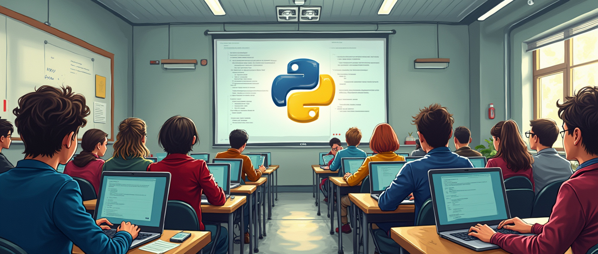

# SCB Python workshop
This is the repository for the Sound Communication and Behaviour Group's Python workshop 2025. You will find all teaching materials in this repository.

## Presentation
https://docs.google.com/presentation/d/1bH0J_6equk9mno7ffnL0q0_LL3T7o7mY8hCRrttJ4Bg/edit?usp=sharing

## Exercises and tutorials
### Exercise 1 - Python basics
This exercise will teach you the basics of Python.
* [Exercise 1](./exercise-1/exercise_1_python_basics.ipynb)
* [Exercise 1 solution](./exercise-1/exercise_1_python_basics_solution.ipynb)

### Exercise 2 - Make venvs and share them
This exercise is mainly in the terminal. You learn how to make and share virtual environments.

1. Make a virtual environment (venv) with conda and python version 3.12. 
    * Activate it and use `conda info` and/or `conda config --show channels` commands to display information about the environment’s package channels (i.e. repositories from which packages will be installed)
    * Add the conda-forge channel (more up-to-date and community-run). Use `conda config -h` (or `--help`) or https://docs.conda.io/projects/conda/en/latest/user-guide/tasks/manage-channels.html to learn how to do that . Once added, display the environment’s channel priority information, and make sure it is set to 'strict'.
2. Install the following packages:
    * `spyder` and `spyder-notebook `
    * `librosa`
    * `Scipy` version 1.15.1
    * `pip-chill`
    * `asciimatics`, `pycowsay` and/or `coolname` (check out their PyPI sites)
3. Export the environment to an `<environment>.yml` file. The file should work across platforms.
    * Try creating an environment file for your operating system and compare the two .yml files.
4. Share the file with someone in class and take their `<environment>.yml` file in return.
5. Make another venv using that environment file

Here is the [solution to exercise 2](./exercise-2/exercise_2_venvs_solution.txt).

### Exercise 3 - Write a Python module and use it
Here is the a template for exercise 3: [my_module.py](./exercise-3/my_module.py) and [my_script.py](./exercise-3/my_script.py).

1. Make a project folder called "exercise-3".
2. Write a Python module called `my_module.py` by opening a script in your favorite editor.
    * Define at least 3 functions in `my_module.py`. 
    * Each of the functions should have a variation of positional and keyword arguments.
    * Write docstrings for your functions.
3. Create a second script `my_script.py` in the same directory and import the module.
4. Execute all of your functions in `my_script.py`. Use a variation of arguments to test your functions. You should also print the docstring to the terminal using the `help(my_module.<your_function>)` command.
5. Now move the `my_module.py` file into a different directory and adjust the imports accordingly.
    * Move the file into a new directory within "exercise-3". 
    * Move the file into a different directory outside of "exercise-3". Use the sys module to append the new path/location of `my_module.py`. 

Here is the [solution to exercise 3](./exercise-2/solution/).

### Exercise 4 - Your first acoustic analysis project in Python
Here is the [template for exercise 4](./exercise-4/exercise_4_acoustic_analysis.py).

1. Make a new directory and unzip the zip-folder "find_the_wavs.zip" into it.
2. Make a new venv for this exercise and install the packages `scipy`, `matplotlib`, `soundfile` and `sounddevice`.
3. There are 15 audio files hidden in "find_the_wavs". Find all and put them into a single list. Sort the list based on the filenames.
4. Read a random audiofile into an array.
    * Extract the following parameters: sampling rate, number of channels, total number of samples, duration, bit depth.
    * Compare the output array from soundfile and scipy. What is the difference and how can you convert one to the other?
    * Play the audio file at an appropriate sampling rate.
5. [_Optional_] Loop over all recordings: which has the most channels? Which is the longest recording (duration in seconds)?
6. Pick the recording #5 to continue this exercise. Plot the oscillogram of the recording with an appropriate time scale. 
7. Select a call segment to continue your analysis with. The segment should only contain a single vocalization. This segment will be used from here onwards.
    * Spyder: to get inline plots working you need to unselect "Mute inline plotting" in the Plots pane menu (right side)
    * Now the plots are inline in the consol. To make it interactive you need to run %matplotlib qt in the consol. Then figures are opened in a separate window. Run the figure code again after setting matplotlib to qt. To move back to inline plots run %matplotlib inline. 
    * Default handling of plots can be changed in Tools > Preferences > IPython console > Graphics.
8. Generate a plot that indicates which part of the recording segment contains 95% of the energy. You can use the cumulative energy to find the correct window.
9. [_Optional_] Extract the following basic parameters from the time domain signal: peak, peak-to-peak and RMS pressure, energy.
10. Transform the signal segment into the frequency domain. Additionally, estimate the power spectral density with Welch's method. Plot both into the same figure. Make sure you normalize both correctly to display [dB/Hz] on the y-axis.
11. [_Optional_] Extract the following basic parameters from the frequency domain signal: peak frequency, bandwidth and centroid frequency.
12. Plot a spectrogram of the whole recording.
13. [_Optional_] Convert the analysis pipeline into a series of functions such that you can loop over all 15 recordings and display all plots and extract all parameters where possible. 

Here is the [solution to exercise 4](./exercise-4/exercise_4_acoustic_analysis_solution.py).

### Other tutorials
topic | tutorial
--- | ---
Packaging 101 - make you own installable package | https://www.pyopensci.org/python-package-guide/tutorials/intro.html 
Pandas | https://pandas.pydata.org/docs/getting_started/intro_tutorials/index.html
Matplotlib | https://matplotlib.org/stable/users/explain/quick_start.html#quick-start
Numpy | https://numpy.org/devdocs/user/quickstart.html
Seaborn | https://seaborn.pydata.org/tutorial/introduction.html
Sklearn (PCA example) | https://scikit-learn.org/stable/auto_examples/decomposition/plot_pca_iris.html#sphx-glr-auto-examples-decomposition-plot-pca-iris-py 
